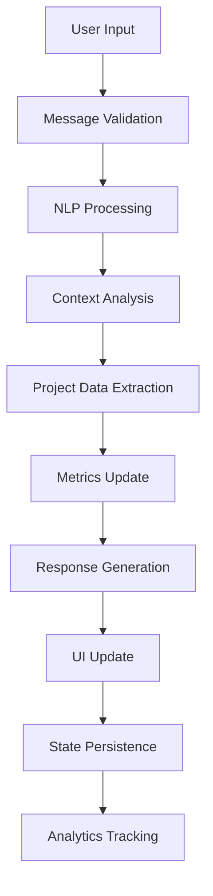

# 🏗️ Arquitectura Técnica - Chatbot DevTailor

## 📐 Arquitectura General

### **Patrón de Arquitectura: Component-Based Architecture**

```
┌─────────────────────────────────────────────────────────┐
│                    UI LAYER (React)                     │
├─────────────────────────────────────────────────────────┤
│  ChatbotPage → ChatInterface → MessageBubble           │
│       ↓              ↓              ↓                  │
│  ProjectSummary → ConversationMetrics → QuickActions   │
└─────────────────────────────────────────────────────────┘
            ↓ State Management ↓
┌─────────────────────────────────────────────────────────┐
│                BUSINESS LOGIC LAYER                     │
├─────────────────────────────────────────────────────────┤
│  MessageProcessor → ProjectAnalyzer → ResponseGenerator │
│       ↓                    ↓                    ↓       │
│  ConversationTracker → MetricsCalculator → LeadScorer  │
└─────────────────────────────────────────────────────────┘
            ↓ Data Flow ↓
┌─────────────────────────────────────────────────────────┐
│                    DATA LAYER                           │
├─────────────────────────────────────────────────────────┤
│  LocalStorage ← → SessionStorage ← → IndexedDB          │
│       ↓                    ↓                    ↓       │
│  ConversationStore → ProjectStore → MetricsStore       │
└─────────────────────────────────────────────────────────┘
```

---

## 🧩 Componentes del Sistema

### **1. Core Components**

#### **`ChatbotPage` (Main Controller)**
```typescript
interface ChatbotPageProps {
  initialMode?: 'chat' | 'summary' | 'metrics';
  userId?: string;
  sessionId?: string;
}

const ChatbotPage: React.FC<ChatbotPageProps> = ({
  initialMode = 'chat',
  userId,
  sessionId
}) => {
  // Estado principal del chatbot
  const [messages, setMessages] = useState<Message[]>([]);
  const [currentProject, setCurrentProject] = useState<ProjectAnalysis>();
  const [conversationMetrics, setConversationMetrics] = useState<Metrics>();
  
  // Efectos para persistencia y sincronización
  useEffect(() => {
    // Cargar sesión existente o crear nueva
    // Configurar auto-save
    // Inicializar métricas
  }, [sessionId]);
  
  return (
    <ChatProvider value={{ messages, currentProject, metrics }}>
      <div className="chatbot-layout">
        <ConversationMetrics />
        <ChatInterface />
        <ProjectSummary />
      </div>
    </ChatProvider>
  );
};
```

#### **`ChatInterface` (Chat Engine)**
```typescript
interface ChatInterfaceProps {
  onMessageSent: (message: string) => void;
  onTypingStart: () => void;
  onTypingEnd: () => void;
  disabled?: boolean;
}

const ChatInterface: React.FC<ChatInterfaceProps> = ({
  onMessageSent,
  onTypingStart,
  onTypingEnd,
  disabled = false
}) => {
  // Gestión de mensajes y entrada de usuario
  const [inputValue, setInputValue] = useState("");
  const [isTyping, setIsTyping] = useState(false);
  const messagesEndRef = useRef<HTMLDivElement>(null);
  
  // Auto-scroll y animaciones
  useEffect(() => {
    scrollToBottom();
  }, [messages]);
  
  // Procesamiento de entrada
  const handleSendMessage = useCallback((content: string) => {
    const userMessage = createMessage(content, true);
    addMessage(userMessage);
    
    // Procesar respuesta del bot
    const botResponse = generateBotResponse(content);
    simulateTyping(botResponse);
  }, []);
  
  return (
    <div className="chat-interface">
      <MessageList messages={messages} />
      <TypingIndicator isVisible={isTyping} />
      <MessageInput 
        value={inputValue}
        onChange={setInputValue}
        onSend={handleSendMessage}
        disabled={disabled || isTyping}
      />
    </div>
  );
};
```

### **2. Business Logic Components**

#### **`MessageProcessor` (Core AI Engine)**
```typescript
class MessageProcessor {
  private nlpEngine: NLPEngine;
  private projectAnalyzer: ProjectAnalyzer;
  private responseGenerator: ResponseGenerator;
  
  constructor() {
    this.nlpEngine = new NLPEngine();
    this.projectAnalyzer = new ProjectAnalyzer();
    this.responseGenerator = new ResponseGenerator();
  }
  
  async processMessage(message: string, context: ConversationContext): Promise<ProcessedMessage> {
    // 1. Análisis de lenguaje natural
    const nlpResult = await this.nlpEngine.analyze(message);
    
    // 2. Extracción de información del proyecto
    const projectData = this.projectAnalyzer.extractProjectInfo(nlpResult, context);
    
    // 3. Actualización de métricas
    const metrics = this.calculateMetrics(projectData, context);
    
    // 4. Generación de respuesta
    const response = this.responseGenerator.generate(nlpResult, projectData, metrics);
    
    return {
      userMessage: message,
      botResponse: response,
      extractedData: projectData,
      metrics: metrics,
      confidence: nlpResult.confidence
    };
  }
}
```

#### **`ProjectAnalyzer` (Intelligence Engine)**
```typescript
interface ProjectAnalysisEngine {
  analyzeProjectType(message: string): ProjectType;
  extractRequirements(message: string, history: Message[]): Requirement[];
  estimateComplexity(requirements: Requirement[]): ComplexityLevel;
  suggestTechnologies(projectType: ProjectType, requirements: Requirement[]): Technology[];
  calculateTimeline(complexity: ComplexityLevel, requirements: Requirement[]): Timeline;
  estimateBudget(timeline: Timeline, complexity: ComplexityLevel): BudgetRange;
}

class ProjectAnalyzer implements ProjectAnalysisEngine {
  private keywordMatcher: KeywordMatcher;
  private requirementExtractor: RequirementExtractor;
  private complexityCalculator: ComplexityCalculator;
  
  analyzeProjectType(message: string): ProjectType {
    const keywords = this.keywordMatcher.extractKeywords(message);
    const patterns = {
      web: ['web', 'página', 'sitio', 'landing', 'portal', 'dashboard'],
      mobile: ['app', 'móvil', 'android', 'ios', 'aplicación'],
      automation: ['automatizar', 'proceso', 'workflow', 'bot', 'script'],
      ai: ['inteligencia', 'machine learning', 'ia', 'chatbot', 'predicción'],
      erp: ['erp', 'gestión', 'crm', 'inventario', 'facturación']
    };
    
    let maxScore = 0;
    let detectedType: ProjectType = 'web';
    
    Object.entries(patterns).forEach(([type, typeKeywords]) => {
      const score = this.calculateKeywordScore(keywords, typeKeywords);
      if (score > maxScore) {
        maxScore = score;
        detectedType = type as ProjectType;
      }
    });
    
    return detectedType;
  }
  
  extractRequirements(message: string, history: Message[]): Requirement[] {
    const functionalityPatterns = [
      /necesito (.*?)(?:\.|,|$)/gi,
      /quiero (.*?)(?:\.|,|$)/gi,
      /debe (.*?)(?:\.|,|$)/gi,
      /requiero (.*?)(?:\.|,|$)/gi
    ];
    
    const requirements: Requirement[] = [];
    
    functionalityPatterns.forEach(pattern => {
      const matches = message.matchAll(pattern);
      for (const match of matches) {
        requirements.push({
          id: generateId(),
          description: match[1].trim(),
          priority: this.calculatePriority(match[1]),
          type: this.classifyRequirement(match[1]),
          confidence: this.calculateConfidence(match[1])
        });
      }
    });
    
    return requirements;
  }
}
```

### **3. Data Layer Components**

#### **`ConversationStore` (State Management)**
```typescript
interface ConversationState {
  currentSession: ChatSession;
  messages: Message[];
  projectData: ProjectAnalysis;
  metrics: ConversationMetrics;
  userProfile: UserProfile;
}

class ConversationStore {
  private state: ConversationState;
  private subscribers: Set<(state: ConversationState) => void>;
  private persistenceManager: PersistenceManager;
  
  constructor() {
    this.state = this.initializeState();
    this.subscribers = new Set();
    this.persistenceManager = new PersistenceManager();
  }
  
  // State mutations
  addMessage(message: Message): void {
    this.state.messages.push(message);
    this.updateMetrics();
    this.notifySubscribers();
    this.persistState();
  }
  
  updateProjectData(data: Partial<ProjectAnalysis>): void {
    this.state.projectData = { ...this.state.projectData, ...data };
    this.notifySubscribers();
    this.persistState();
  }
  
  // Subscription management
  subscribe(callback: (state: ConversationState) => void): () => void {
    this.subscribers.add(callback);
    return () => this.subscribers.delete(callback);
  }
  
  private notifySubscribers(): void {
    this.subscribers.forEach(callback => callback(this.state));
  }
  
  // Persistence
  private async persistState(): Promise<void> {
    await this.persistenceManager.save(this.state);
  }
  
  async loadState(sessionId: string): Promise<void> {
    const savedState = await this.persistenceManager.load(sessionId);
    if (savedState) {
      this.state = savedState;
      this.notifySubscribers();
    }
  }
}
```

---

## 🔄 Flujo de Datos

### **Message Processing Flow**



### **State Management Flow**

```typescript
// 1. User Action
userInput → validateInput() → processMessage()

// 2. Business Logic
processMessage() → analyzeProject() → updateMetrics() → generateResponse()

// 3. State Update
updateState() → notifyComponents() → renderUI()

// 4. Persistence
saveToLocalStorage() → syncWithServer() → updateAnalytics()
```

### **Component Communication**

```typescript
// Context Provider Pattern
const ChatContext = createContext<ChatContextType>();

// Custom Hooks for State Access
const useChat = () => {
  const context = useContext(ChatContext);
  if (!context) {
    throw new Error('useChat must be used within ChatProvider');
  }
  return context;
};

// Event-Driven Communication
const useChatEvents = () => {
  const { dispatch } = useChat();
  
  const sendMessage = useCallback((content: string) => {
    dispatch({ type: 'SEND_MESSAGE', payload: content });
  }, [dispatch]);
  
  const updateProject = useCallback((data: ProjectData) => {
    dispatch({ type: 'UPDATE_PROJECT', payload: data });
  }, [dispatch]);
  
  return { sendMessage, updateProject };
};
```

---

## 🔧 Performance Optimizations

### **1. Component Optimization**

```typescript
// Memoización de componentes pesados
const MessageBubble = React.memo<MessageBubbleProps>(({ message }) => {
  return (
    <div className={`message ${message.isUser ? 'user' : 'bot'}`}>
      {message.content}
    </div>
  );
});

// Lazy loading de componentes
const ProjectSummary = React.lazy(() => import('./ProjectSummary'));
const ConversationMetrics = React.lazy(() => import('./ConversationMetrics'));

// Virtual scrolling para listas largas
const VirtualizedMessageList = ({ messages }: { messages: Message[] }) => {
  return (
    <FixedSizeList
      height={400}
      itemCount={messages.length}
      itemSize={60}
      itemData={messages}
    >
      {MessageBubble}
    </FixedSizeList>
  );
};
```

### **2. State Optimization**

```typescript
// Selector pattern para evitar re-renders innecesarios
const useMessageSelector = <T>(selector: (messages: Message[]) => T): T => {
  const { messages } = useChat();
  return useMemo(() => selector(messages), [messages, selector]);
};

// Debounced updates para métricas
const useDebouncedMetrics = (messages: Message[], delay: number = 300) => {
  const [metrics, setMetrics] = useState<Metrics>();
  
  useEffect(() => {
    const timer = setTimeout(() => {
      setMetrics(calculateMetrics(messages));
    }, delay);
    
    return () => clearTimeout(timer);
  }, [messages, delay]);
  
  return metrics;
};
```

### **3. Data Persistence Optimization**

```typescript
// Batch updates para reducir escrituras
class BatchedPersistence {
  private pendingUpdates: ConversationState[] = [];
  private timer: NodeJS.Timeout | null = null;
  
  queue(state: ConversationState): void {
    this.pendingUpdates.push(state);
    
    if (this.timer) {
      clearTimeout(this.timer);
    }
    
    this.timer = setTimeout(() => {
      this.flush();
    }, 1000);
  }
  
  private async flush(): Promise<void> {
    if (this.pendingUpdates.length > 0) {
      const latestState = this.pendingUpdates[this.pendingUpdates.length - 1];
      await this.persistenceManager.save(latestState);
      this.pendingUpdates = [];
    }
  }
}
```

---

## 🧪 Testing Strategy

### **1. Unit Tests**

```typescript
// Test para MessageProcessor
describe('MessageProcessor', () => {
  let processor: MessageProcessor;
  
  beforeEach(() => {
    processor = new MessageProcessor();
  });
  
  it('should classify web project correctly', async () => {
    const message = "Necesito una página web para mi empresa";
    const result = await processor.processMessage(message, {});
    
    expect(result.extractedData.type).toBe('web');
    expect(result.confidence).toBeGreaterThan(0.8);
  });
  
  it('should extract requirements from message', async () => {
    const message = "Quiero un sistema de login y un dashboard administrativo";
    const result = await processor.processMessage(message, {});
    
    expect(result.extractedData.requirements).toContain('sistema de login');
    expect(result.extractedData.requirements).toContain('dashboard administrativo');
  });
});
```

### **2. Integration Tests**

```typescript
// Test de flujo completo
describe('Chatbot Integration', () => {
  it('should complete full conversation flow', async () => {
    const { getByTestId, getByText } = render(<ChatbotPage />);
    
    // Enviar mensaje inicial
    const input = getByTestId('message-input');
    const sendButton = getByTestId('send-button');
    
    fireEvent.change(input, { target: { value: 'Necesito una web para mi negocio' } });
    fireEvent.click(sendButton);
    
    // Verificar respuesta del bot
    await waitFor(() => {
      expect(getByText(/desarrollo web es nuestra especialidad/)).toBeInTheDocument();
    });
    
    // Verificar actualización de métricas
    await waitFor(() => {
      expect(getByTestId('project-progress')).toHaveTextContent('25%');
    });
  });
});
```

### **3. E2E Tests**

```typescript
// Test con Playwright
test.describe('Chatbot E2E', () => {
  test('should generate project summary after conversation', async ({ page }) => {
    await page.goto('/chatbot');
    
    // Simular conversación completa
    const messages = [
      'Necesito una aplicación web',
      'Para gestión de inventario',
      'Con usuarios administradores y vendedores',
      'Integración con APIs de pago'
    ];
    
    for (const message of messages) {
      await page.fill('[data-testid="message-input"]', message);
      await page.click('[data-testid="send-button"]');
      await page.waitForSelector('[data-testid="bot-message"]');
    }
    
    // Verificar generación de resumen
    await expect(page.locator('[data-testid="project-summary"]')).toBeVisible();
    await expect(page.locator('[data-testid="project-type"]')).toContainText('web');
  });
});
```

---

## 📊 Monitoring & Analytics

### **Error Tracking**

```typescript
class ErrorTracker {
  static track(error: Error, context: ErrorContext): void {
    // Log local para desarrollo
    console.error('Chatbot Error:', error, context);
    
    // Envío a servicio de tracking
    analytics.track('chatbot_error', {
      error: error.message,
      stack: error.stack,
      context: context,
      timestamp: new Date().toISOString(),
      userId: context.userId,
      sessionId: context.sessionId
    });
  }
}
```

### **Performance Monitoring**

```typescript
class PerformanceMonitor {
  static measureResponseTime(operationName: string, fn: () => Promise<any>): Promise<any> {
    const startTime = performance.now();
    
    return fn().finally(() => {
      const endTime = performance.now();
      const duration = endTime - startTime;
      
      analytics.track('performance_metric', {
        operation: operationName,
        duration: duration,
        timestamp: new Date().toISOString()
      });
    });
  }
}
```

---

*Documentación actualizada: Julio 2025* 